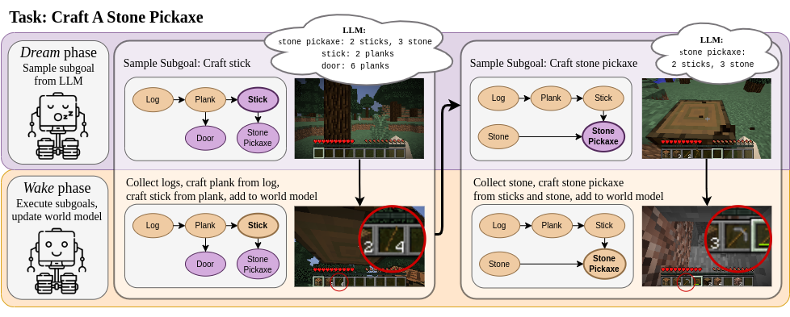

# DECKARD Minecraft Agent



The DECKARD Minecraft agent uses knowledge from large language models to assist the exploration for reinforcement learning agents. This repository includes our implementation of the DECKARD agent for collecting and crafting arbitrary items in Minecraft. For additional details about our approach please see our [website](https://deckardagent.github.io/) and paper, [Do Embodied Agents Dream of Electric Sheep?](https://arxiv.org/abs/2301.12050).

## Installation

We use [Minedojo](https://github.com/MineDojo/MineDojo) for agent training and evaluation in Minecraft. Before installing python dependencies for Minedojo, you will need `openjdk-8-jdk` and `python>=3.9`. This [guide](https://docs.minedojo.org/sections/getting_started/install.html#prerequisites) contains additional installation details for the Minedojo simulator.

If you didn't clone the VPT submodule yet, run:
```
git submodule update --init --recursive
```

Next, install python packages: 
```
pip install -r requirements.txt
```

We finetune our agent from OpenAI's [VPT Minecraft agent](https://github.com/openai/Video-Pre-Training). Download their pretrained weights using our script:
```
bash download_model.sh
```

Finally, we use [MineClip](https://github.com/MineDojo/MineCLIP) for reward shaping. Download the weights [here](https://drive.google.com/file/d/1uaZM1ZLBz2dZWcn85rZmjP7LV6Sg5PZW/view?usp=sharing) and place them at `weights/mineclip_attn.pth`.

## Usage

The default way to use DECKARD occasionally pauses exploration to train subtasks. Run this method using:
```
python main.py
```

Alternatively, you can pretrain policies for subtasks by running:
```
python subtask.py --task base_task --target_item log
```

Then, add the trained subtask checkpoint to your yaml config under `techtree_specs.tasks`:
```
my_config:
  task_id: creative
  sim: minedojo
  fast_reset: 0
  terminal_specs:
    max_steps: 10000
  techtree_specs:
    guide_path: data/davinci_techtree.json
    target_item: wooden_pickaxe
    tasks:
      log: log_checkpoint.zip
```

and run DECKARD for building the Minecraft technology tree using:
```
python techtree.py --config my_config
```

Note that Minecraft requires using `xvfb-run` to render on a virtual display when using a headless machine.
